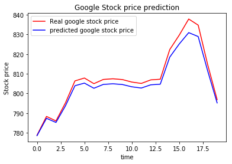

# Google-Maket-Stock-Prediction-using-RNN
Google Maket Stock Prediction using RNN "Keras+Tensorflow"

<h2>prediction on the Trainig set</h2>

<h2>prediction on the test set</h2>

## Python 2.7 + conda 
Install Conda https://conda.io/docs/installation.html
Cheatsheet https://conda.io/docs/_downloads/conda-cheatsheet.pdf

conda create -n tensorflow-p2 python=2.7
source activate tensorflow-p2
conda install numpy pandas matplotlib tensorflow 

